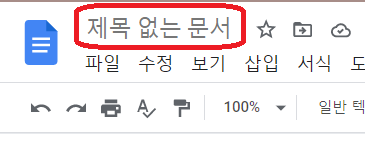

## 구글 독스 제목 클론

---

    디자인
    * 내부 텍스트에 input 컨테이너 맞춤.
    * 마우스가 hover 되면 border 표시

---

    동작
    * 클릭됬을 때
        * 제목 입력 X : 제목 전체 선택
        * 제목 입력 O : 그냥..
    * 엔터, ESC => 문서로 포커스 넘어감.

### 알게된 것, 인상깊었던 것

- selection, range
   selection과 range로 커서(caret) 조작을 할 수 있다.

- border도 공간을 차지한다
   그래서, border 자체를 없애고/만들고 하게되면 디자인에 영향을 준다.
   그래서, border 의 색상을 변경하는 것으로 처리를 해주는게 좋다.
